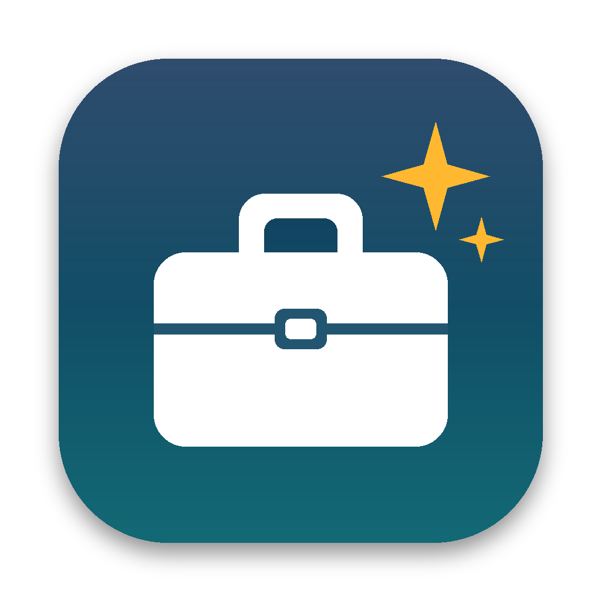
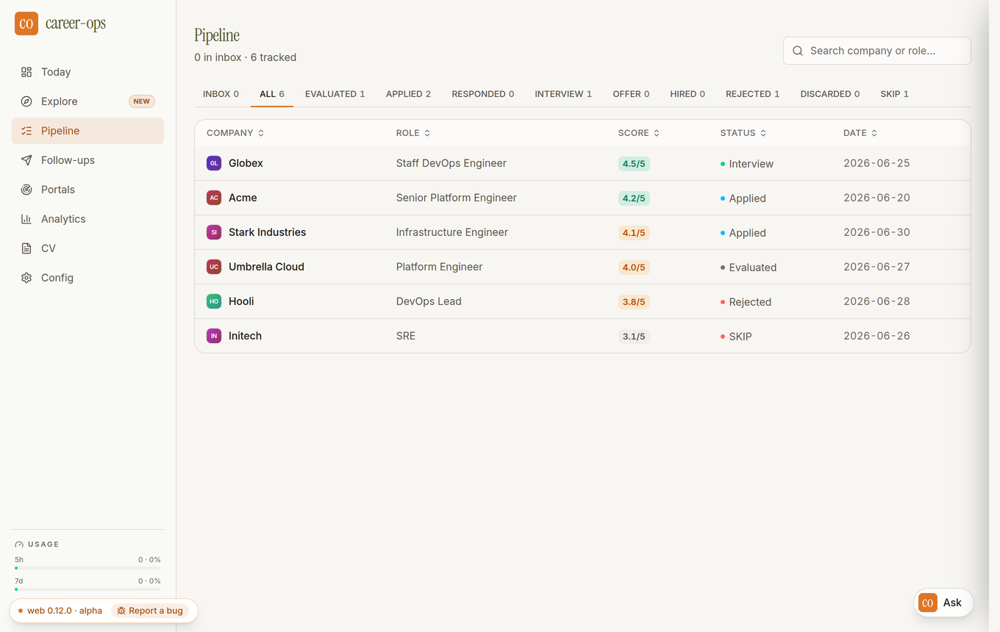
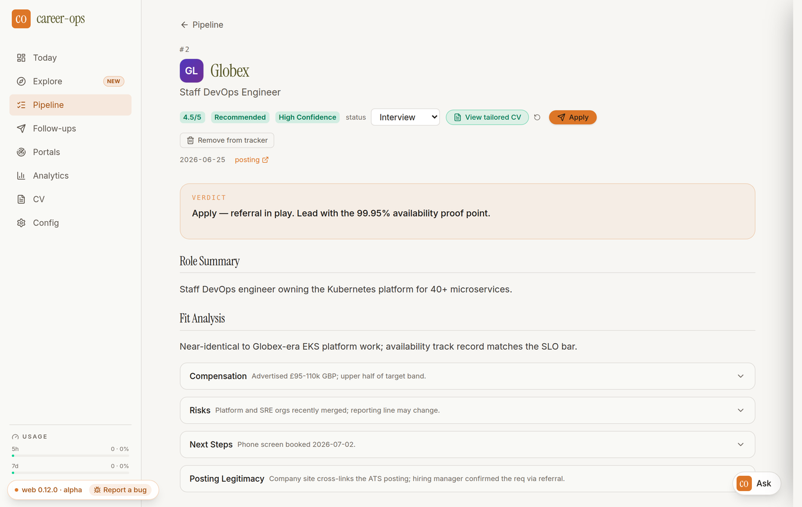

<p align="center"></p>

<h1 align="center">JobDesk</h1>

<p align="center">
A one-line installer that puts <a href="https://github.com/career-ops-hq/career-ops">career-ops</a>,
the open-source AI job-search system, on your Mac as an app with a web UI.
</p>

Paste in the job links you're interested in. For each one, career-ops scores the
posting against your CV, writes a tailored CV and a cover letter for that company,
fills in the application form for you to check, and keeps a tracker of every
application. It runs on your Mac with your own AI account.

<p align="center">
  
  
</p>
<p align="center"><sub>career-ops's web UI in JobDesk, shown with career-ops's sample data: the tracker, and one job's evaluation.</sub></p>

> JobDesk is an unofficial installer. It sets up career-ops and its official web UI,
> but it isn't made by, affiliated with, or endorsed by the career-ops project.

## Install

1. Open **Terminal**: press ⌘-Space, type `Terminal`, press Return.
2. Paste this line and press Return:

   ```bash
   curl -fsSL https://raw.githubusercontent.com/martialstudios/jobdesk/main/install.sh | bash
   ```

3. Answer its two questions (which AI you use, and whether to log in to it now).

It takes 5–10 minutes. When it's done, JobDesk opens in your browser. After that,
open **JobDesk** from Applications, Launchpad or Spotlight like any other app.
To stop it, quit JobDesk from the Dock.

**You'll need:**

- macOS 13.5 (Ventura) or newer, on an Apple Silicon or Intel Mac
- An AI account to do the writing. The installer sets up the matching app:
  - **Claude** (recommended): a Claude Pro or Max plan
  - **ChatGPT** (Codex): a ChatGPT Plus or Pro plan
  - **Gemini**: a free Google account, with lower daily limits
- Google Chrome, if you want JobDesk to fill in application forms
- About 2 GB of free disk space

If your Mac asks to install Apple's **command line developer tools**, click
*Install*. career-ops needs git, which comes with them. The installer waits and
then continues on its own.

Want to read the installer before running it? It's [`install.sh`](install.sh)
in this repo, and nothing in it needs your password.

## Your first session

1. **Config** page: pick your AI helper, for example *Claude Code*.
2. **Home** page: click **Set me up with the assistant**. It asks for your CV,
   target roles, location and salary range in plain language, then writes
   career-ops's setup files for you.
3. **Pipeline**: paste job links, one per line, and evaluate them. Each job gets a
   written evaluation, a 1–5 fit score, a tailored CV, and a cover-letter draft that
   you approve before it's turned into a PDF.
4. **Apply**: JobDesk opens the application in Chrome and fills it in.
   **You review it and press Submit yourself.** career-ops never submits anything
   for you.

## Every day

- **Open:** click JobDesk. **Stop:** quit JobDesk in the Dock.
- **Your files** are in `~/career-ops` (your home folder → `career-ops`):
  your CV in `cv.md`, the tracker in `data/applications.md`, and PDFs in `output/`.
- **Terminal commands**, if you like them:

  | Command | What it does |
  |---|---|
  | `jobdesk open` | start JobDesk and open it in your browser |
  | `jobdesk stop` | stop it |
  | `jobdesk status` | is it running, and which versions are installed |
  | `jobdesk login` | log in to your AI again (Claude, Codex or Gemini) |
  | `jobdesk update` | get the latest career-ops, web UI and JobDesk |
  | `jobdesk doctor` | check that everything is set up correctly |
  | `jobdesk logs` | show the log if something goes wrong |
  | `jobdesk uninstall` | remove JobDesk, keeping your data |

  If Terminal says `command not found`, use the full path
  `~/.jobdesk/bin/jobdesk` instead.

## Updating

Run `jobdesk update`, or paste the install line again. Both do the same thing:

- career-ops updates itself with its own updater, which only replaces program
  files. Your CV, tracker, reports and PDFs are never touched.
- The web UI is rebuilt for the new version. If that build fails, the previous
  version stays in place.
- JobDesk and its app are refreshed.

## Sharing it with a friend

Send them this page. Each person installs JobDesk on their own Mac and uses their
own AI account, so nothing is shared between you: not your CV, not your tracker,
and not your AI usage.

### Or: a JobDesk.dmg with no Terminal and no logins

For someone who shouldn't have to touch Terminal, you can build a `JobDesk.dmg`
on your Mac that has everything inside it: career-ops, its web UI (already
built), Node.js, Claude Code and the PDF browser, for Apple Silicon and Intel
Macs. It also carries **your** Anthropic API key, so they never log in to
anything. Their use is billed to your Anthropic Console account.

1. At [console.anthropic.com](https://console.anthropic.com), create an API key
   just for JobDesk. Under Billing → Limits, set a monthly spend limit you're
   comfortable with.
2. Store the key in your Mac's Keychain. Terminal asks for it and shows nothing
   as you paste:

   ```bash
   security add-generic-password -a "$USER" -s jobdesk-anthropic-api-key -w
   ```

3. Build (about 5 minutes; the result is about 500 MB):

   ```bash
   tools/build-dmg.sh
   ```

   It lands in `dist/JobDesk-<version>.dmg`.
4. Give them the DMG and tell them to open **How to open JobDesk.png** inside it.
   The steps: drag JobDesk into Applications and open it. The first time, macOS
   blocks it because it isn't signed with an Apple Developer ID. They click
   **Open Anyway** once, in System Settings → Privacy & Security. JobDesk then
   sets itself up in about a minute and opens in their browser.

Keep in mind:

- **Anyone with the DMG can dig the key out of it.** Share it privately (AirDrop,
  a USB stick, a private link), never publicly. If it leaks, delete the key in
  the Console and build a new DMG with a new key.
- Their CV and tracker stay on their Mac. Only what they ask Claude to do goes
  to Anthropic, on your key.
- To update them, build a newer DMG and have them drag the new JobDesk into
  Applications again. Their data is kept.

## Uninstalling

Run `jobdesk uninstall`. It removes JobDesk.app and the `~/.jobdesk` folder
(JobDesk's own copy of Node.js, the web UI and logs). It keeps:

- your `~/career-ops` folder with your data. Delete it yourself if you don't need it.
- Claude Code, which is a separate app from Anthropic.

## Privacy and cost

- Everything runs on your Mac. The web UI only answers on `127.0.0.1`, so other
  devices on your network can't reach it.
- Your CV and job details go only to the AI provider you chose, through that
  provider's official app, on your own account. Evaluations and cover letters
  count toward your plan's usage like any other chat, so large batches use more.
- JobDesk has no analytics, and it turns off Next.js telemetry.

## Troubleshooting

| Problem | Fix |
|---|---|
| "JobDesk couldn't start" | Click **Show Log**, or run `jobdesk doctor` in Terminal. |
| The AI doesn't respond, or says to log in | Run `jobdesk login` in Terminal. |
| The Apply page says it needs Chrome | Install [Google Chrome](https://www.google.com/chrome/). |
| Port 4788 is used by another app | JobDesk automatically uses the next free port. To pick one yourself, run `jobdesk update --port=5000`. |
| No PDFs are created | Run `jobdesk update`. It retries downloading the browser career-ops uses to make PDFs. |
| Anything else | Run `jobdesk doctor` and include its output when you ask for help. |

## How it works

`install.sh` works through these steps, and running it again repeats them to
repair or update:

1. Checks for git, and offers Apple's developer tools if it's missing.
2. Downloads its own copy of Node.js 24 from nodejs.org into `~/.jobdesk`,
   checking the download against Node's published checksums.
3. Clones the latest career-ops release into `~/career-ops`. This is the same
   thing career-ops's own `npx @santifer/career-ops init` does.
4. Builds career-ops's official web UI from that same release into `~/.jobdesk/ui`,
   and points it at your folder with `CAREER_OPS_ROOT`. Keeping the build out of
   your folder means your git checkout stays clean. career-ops's updater also
   doesn't touch `web/`, so this is the only way to keep the UI current.
5. Installs your AI helper with that provider's official installer.
6. Creates `JobDesk.app` with `osacompile` on your Mac. Because the app is built
   locally rather than downloaded, macOS never quarantines it or shows the
   "unidentified developer" warning.

The app runs `jobdesk open` when you start it and `jobdesk stop` when you quit it.
The `jobdesk` script starts the web UI's Next.js server in the background on
`127.0.0.1:4788`.

## Credits and license

- [career-ops](https://github.com/career-ops-hq/career-ops) is by Santiago
  Fernández de Valderrama and contributors, under the MIT license. "career-ops" is
  a trademark of its author, and JobDesk only describes itself as working with it.
- JobDesk is released under the [MIT license](LICENSE).
